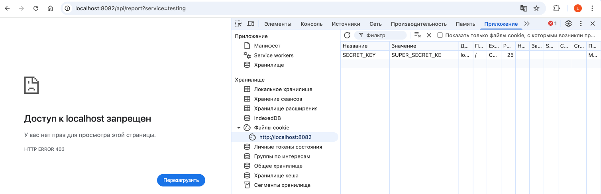
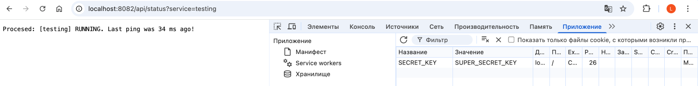
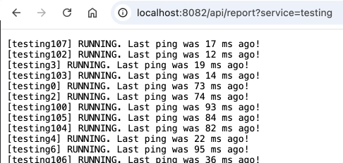

# Лабораторная работа №1 

Автор - Круглов Леонид ИУ6-51Б

## Задание

Идея:
- A → отправляет запрос на статус серверов.
- B → проверяет статус ряда сервисов.

Задача:
- Реализовать WebClient запрос.
- Обработать Mono/Flux.
- Покрыть логирование через фильтры

## Реализация

### Логика работы сервера

Сервер имитирует состояние сервисов путём хранения 'пингов'. Предполагается, что ряд серверов с некоторой частатой отправляют пинг о том, что они живы. В пинге хранится название сервиса и дата пинга (в виде количества миллисекунд с 1 января 1970 года).

После создания такой базы пингов (это делается при каждом запросе о получении статуса сервера) происходит линейный поиск самого последнего пинга и его возврат в качестве ответа.

### Исскуственная сложность

Сложность (и время) ответа получается большим за счёт создания большой таблицы пингов и линейного поиска последнего бита

### Фильтры

На сервере реализовано три фильтра:

- `AuthFilter` проверяет, что запрос поступил с определёнными куки - `SECRET_KEY` должен быть равен `SUPER_SECRET_KEY` (заговок Cookie: SECRET_KEY=SUPER_SECRET_KEY)
- `LoggerFilter` выводит все входящие запросы и их результат (код ответа)
- `logRequest` выводит запросы, которые отправляются на сервер состояния сервисов (через WebClient)

## Тестирование

Для запуска необходимо прописать `./mvnw spring-boot:run` в папках `/client` и `/server`

Сервис 1 запуститься на `http://localhost:8082` 
Сервис 2 запуститься на `http://localhost:8083`

Для тестирования будем использовать браузер с запросами `/api/status` и `/api/report`:
- `http://localhost:8082/api/status?service=[название сервиса]` проверяет состояние одного сервиса (используется `Mono`)
- `http://localhost:8083/api/status?service=[название сервиса]` проверяет состояние группы сервисов (используется `Flux`)

### Попробуем получить статус сервиса без куки авторизации:

### Попробуем уже с куки авторизации:

### Попробуем запросить состояния группы сервисов (рисунок обрезан):

Поскольку запрос `/api/report` является `Flux`, то он делает 200 запросов к сервисам, а дальше как только получает ответ от сервиса состояний отправляет сразу ответ нам - поэтому мы получаем состояния сервисом не по порядку.